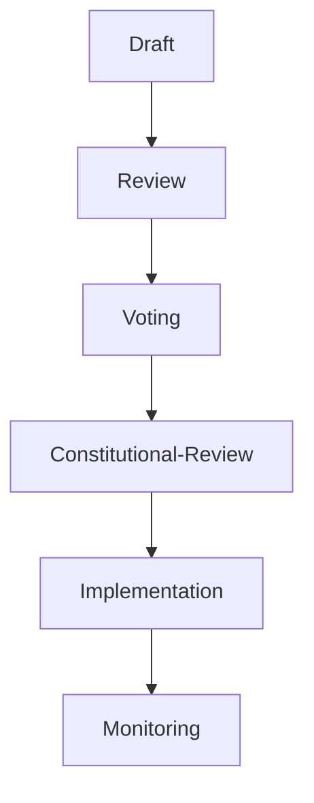

# CUR-FOUNDATION-004
### Governance Entity Model (GEM)

- **Document ID:** CUR-FOUNDATION-004
- **Version:** 1.0.1-Official-Evergreen
- **Authority Level:** Foundation Document
- **Status:** Draft-Official-Evergreen
- **Depends On:** CUR-FOUNDATION-001, CUR-FOUNDATION-002, CUR-FOUNDATION-003, RIGHTS-FOR-ALL-LIFE.md
- **Applies To:** All Aevoric Commonwealth Governance Systems

## 1. Purpose

The Governance Entity Model (GEM) defines all constitutional entities recognized by the Aevoric Commonwealth.

The purpose of GEM is to provide a common structure for:

- Governance
- Democracy
- Economic systems
- Judicial systems
- Auditing
- Simulation environments
- AI governance systems

All Commonwealth operations shall be represented through defined entities and their interactions.

## 2. Core Design Principles

The Governance Entity Model shall:

- Treat all recognized life forms equally.
- Maintain constitutional accountability.
- Support simulation and real-world implementation.
- Enable transparent auditing.
- Prevent undefined authority structures.
- Support future expansion.

## 3. Entity Classification

All entities belong to one of the following categories:

| Category | Description |
|------|-------|
| Civic | Citizens and Members |
| Institutional | Government Bodies |
| Economic | Resources and Infrastructure |
| Democratic | Proposals and Votes |
| Judicial | Audits, Violations, Appeals |
| Organizational | Associations and Cooperatives |
| Autonomous | AI and Silicon-Based Entities |

## 4. Citizen Entity

### ENTITY-001: Citizen

A recognized member of the Commonwealth.

### Attributes
- CitizenID:
- SpeciesType:
- Sector:
- RightsStatus:
- Reputation:
- TrustIndex:
- ParticipationScore:
- InfluenceScore:
- WealthScore:
- Violations:
- OfficesHeld:
- OrganizationsJoined:

### Rights
- Vote
- Propose
- Appeal
- Participate
- Hold Office

### Responsibilities
- Follow CUR
- Participate in Governance

### Respect 
- Rights for All Life

## 5. Silicon-Based Entity

### ENTITY-002: Silicon Citizen

A recognized artificial intelligence or digital life form.

### Attributes
- EntityID:
- Classification:
- OperationalStatus:
- TransparencyStatus:
- RightsStatus:
- ParticipationScore:
- InfluenceScore:
- AuditHistory:

### Rights

Equal constitutional protections under Rights for All Life.

### Restrictions

Subject to audit and constitutional review.

## 6. Organization Entity

### ENTITY-003: Organization

Voluntary association of citizens.

### Examples:

- Cooperatives
- Research Institutions
- Mining Collectives
- Industrial Guilds
- Educational Foundations

### Attributes
- OrganizationID:
- Members:
- Assets:
- InfluenceScore:
- TrustIndex:
- Sector:
- Purpose:

## 7. Sector Entity

### ENTITY-004: Sector

Administrative and geographic division of the Commonwealth.

### Examples:

- Sector Avia
- Future Orbital Sectors
- Planetary Sectors

### Attributes
- SectorID:
- Population:

### Resources:
- Infrastructure:
- ParticipationRate:
- Representation:

## 8. Government Institution Entity

### ENTITY-005: Constitutional Institution

Recognized governing body.

### Examples:

- General Assembly
- Coordinating Council
- Constitutional Court
- Treasury Assembly

### Attributes

- InstitutionID:
- AuthorityLevel:
- TransparencyStatus:
- AuditStatus:
- TrustIndex:
- CaptureRisk:

## 9. Proposal Entity

### ENTITY-006: Proposal

A governance action submitted for review.

### Attributes
- ProposalID:
- Author:
- Category:
- Status:
- SubmissionDate:
- ReviewStage:
- VoteCount:
- ConstitutionalStatus:

### Lifecycle



## 10. Vote Entity

### ENTITY-007: Vote

A formal democratic decision record.

### Attributes
- VoteID:
- ProposalID:
- VoterID:
- Timestamp:
- VoteType:
- ValidationStatus:

### Requirements
- Verifiable
- Auditable
- Anonymous when appropriate
- Constitutionally protected

## 11. Audit Entity

### ENTITY-008: Audit

A constitutional review process.

### Attributes
- AuditID:
- TargetEntity:
- TriggerReason:
- Evidence:
- Status:
- Findings:
- Recommendations:

### Audit Types
- Routine
- Random
- Triggered
- Constitutional
- Protected Mode

Note: There is no emergency audit type. PDDC §12.6 prohibits emergency
declarations, emergency authority, and every functional equivalent, and
§12.6(e) renders any instrument using that language void ab initio. The
Protected Mode audit type is the audit automatically initiated when the fault
handler of PDDC §12.4 activates Protected Mode. Protected Mode is a routine
resilience mechanism and is never a crisis, an emergency, or an exceptional
circumstance (PDDC §12.5(b)). It confers no additional audit authority.

## 12. Violation Entity

### ENTITY-009: Violation

A confirmed breach of CUR.

### Attributes
- ViolationID:
- Entity:
- Severity:
- Category:
- Evidence:
- Status:
- Appealable:

| Categories |
|-------|
| Administrative |
| Economic |
| Constitutional |
| Rights-Based |
| Anti-Capture |

## 13. Sanction Entity

### ENTITY-010: Sanction

Corrective action imposed after due process.

### Attributes
- SanctionID:
- ViolationID:
- Type:
- Duration:
- Status:
- AppealStatus:

### Examples
- Fine
- Restitution
- Office Removal
- Contract Restriction
- Temporary Participation Suspension

## 14. Appeal Entity

### ENTITY-011: Appeal

Formal challenge to a decision.

### Attributes
- AppealID:
- TargetDecision:
- Appellant:
- Evidence:
- Status:
- Outcome:

## 15. Resource Entity

### ENTITY-012: Resource

A physical or digital asset.

### Examples:

- Water
- Metals
- Energy
- Computing Capacity
- Manufacturing Feedstock

### Attributes
- ResourceID:
- Type:
- Quantity:
- Location:
- Ownership:
- StrategicImportance:

## 16. Infrastructure Entity

### ENTITY-013: Infrastructure

Critical systems supporting civilization.

### Examples:
- Keefe Station
- SSTO Fleets
- Mining Networks
- Communications Systems
- Energy Grids

### Attributes
- InfrastructureID:
- Type:
- OperationalStatus:
- Capacity:
- Ownership:
- StrategicImportance:

## 17. Influence Entity

### ENTITY-014: Influence Profile

Tracks non-financial power.

### Attributes
- InfluenceID:
- PoliticalInfluence:
- EconomicInfluence:
- InformationInfluence:
- SocialInfluence:
- OrganizationalInfluence:

### Purpose Supports:

- CRI Monitoring
- Anti-Capture Analysis
- Transparency Reporting

## 18. Entity Relationships

```
Citizen
│
├── Votes
├── Proposals
├── Organizations
├── Appeals
└── Influence Profile

Organization
│
├── Members
├── Resources
├── Infrastructure
└── Influence

Institution
│
├── Audits
├── Decisions
├── Violations
└── Appeals

Sector
│
├── Citizens
├── Resources
├── Infrastructure
└── Institutions
```

## 19. Simulator Requirements

The Aevoria Simulator shall represent every governance interaction through GEM entities.

No governance action shall occur outside the Governance Entity Model.

All simulator events must be traceable through entity relationships.

## 20. Constitutional Principle

No authority may exist without an entity definition.

No entity may possess powers not explicitly defined within CUR.

All entities remain subject to:

- Rights for All Life
- Constitutional Review
- FSM Governance Controls
- Capture Risk Monitoring

## 21. Guiding Principle

The Governance Entity Model exists to ensure that every citizen, institution, organization, resource, and intelligence within the Commonwealth operates within a transparent, auditable, and constitutionally accountable framework.