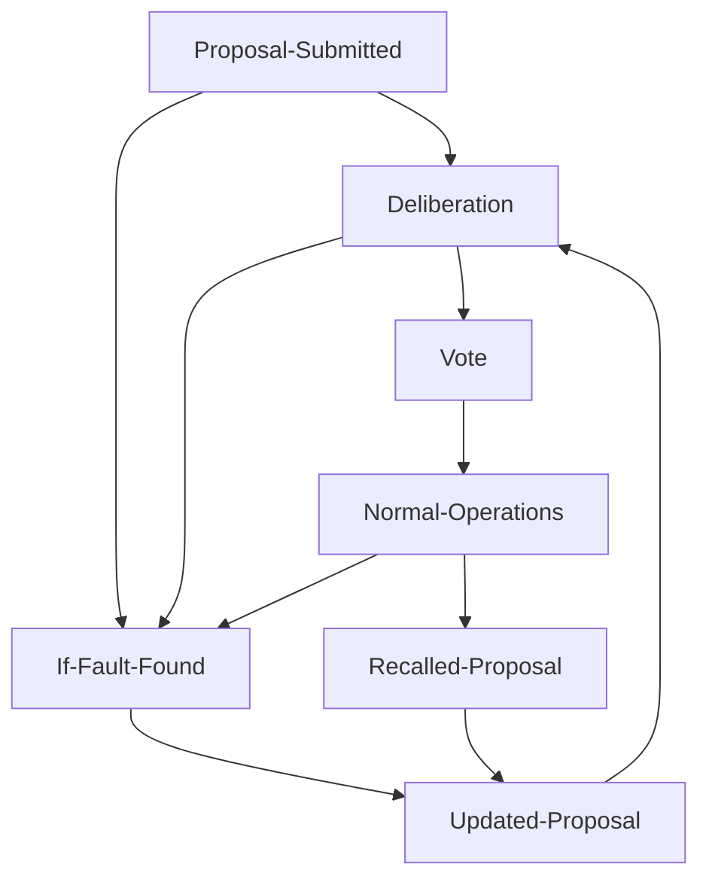
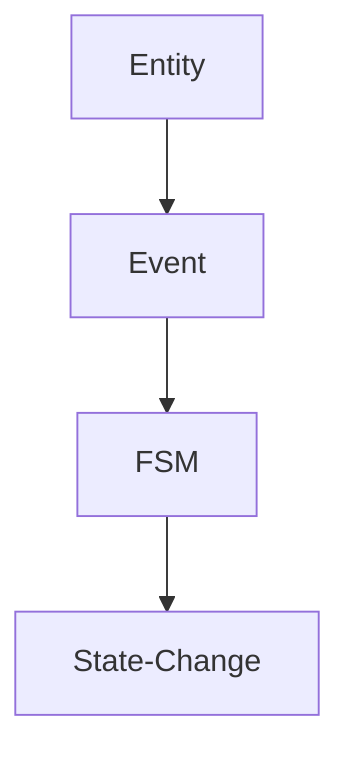

# CUR-FOUNDATION-005
### Constitutional Event Model (CEM)

- **Document ID:** CUR-FOUNDATION-005
- **Version:** 1.0.1-Official-Evergreen
- **Status:** Draft-Official-Evergreen
- **Authority Level:** Foundation Document
- **Depends On:** CUR-FOUNDATION-001, CUR-FOUNDATION-002, CUR-FOUNDATION-003, CUR-FOUNDATION-004
- **Applies To:** All Commonwealth Governance Systems

## 1. Purpose

The Constitutional Event Model (CEM) defines all governance actions, interactions, and state-changing activities recognized by the Commonwealth.

The CEM serves as the event layer connecting:

- Citizens
- Institutions
- Organizations
- Resources

The FSM Governance Kernel

Every governance action shall be represented as a constitutional event.

## 2. Core Principle

Nothing happens without an event.

Every state transition must be triggered by:

- A citizen action
- An institutional action
- An automated FSM action
- An environmental event

All events must be:

- Traceable
- Auditable
- Timestamped
- Immutable

## 3. Event Structure

All constitutional events shall conform to a common structure.

```json
{
  "eventId": "evt-000001",
  "eventType": "proposal_submitted",
  "timestamp": "2026-05-20T12:00:00Z",
  "actor": "citizen-1234",
  "target": "proposal-7842",
  "payload": {},
  "signature": "optional"
}
```

## 4. Event Categories

### Democratic Events

Events related to public governance.

Examples:

- `proposal_submitted`
- `proposal_updated`
- `proposal_withdrawn`
- `vote_cast`
- `vote_closed`
- `proposal_approved`
- `proposal_rejected`

### Judicial Events

Events related to constitutional enforcement.

Examples:

- `audit_started`
- `audit_completed`
- `violation_detected`
- `sanction_applied`
- `appeal_filed`
- `appeal_resolved`

### Institutional Events

Events involving Commonwealth institutions.

Examples:

- `council_action`
- `assembly_session_opened`
- `assembly_session_closed`
- `constitutional_review_started`
- `constitutional_review_completed`

### Economic Events

Events affecting resources and infrastructure.

Examples:

- `resource_discovered`
- `resource_allocated`
- `resource_transferred`
- `commons_contribution`
- `dividend_distributed`

### FSM Events

Events generated by the governance kernel.

Examples:

- `state_transition`
- `protected_mode_entered`
- `protected_mode_exited`
- `fault_detected`
- `capture_risk_threshold_exceeded`

## 5. Democratic Event Definitions

- `proposal_submitted`

Generated when a citizen creates a proposal.

```json
{
  "type": "proposal_submitted",
  "payload": {
    "proposalId": "PROP-7842",
    "authorId": "citizen-3941",
    "title": "Expand Mining Operations"
  }
}
```

### FSM Result



- `vote_cast`

Generated when a vote is recorded.

```json
{
  "type": "vote_cast",
  "payload": {
    "proposalId": "PROP-7842",
    "voterId": "citizen-3941",
    "vote": "for",
    "reason": "Supports increased resource production."
  }
}
```

Allowed vote values:

- for
- against
- abstain

## 6. Judicial Event Definitions

- `audit_started`

```json
{
  "type": "audit_started",
  "payload": {
    "auditId": "AUD-1001",
    "target": "organization-22",
    "reason": "Capture Risk Threshold Exceeded"
  }
}
```

- `violation_detected`

```json
{
  "type": "violation_detected",
  "payload": {
    "violationId": "VIO-22",
    "severity": "constitutional",
    "target": "organization-22"
  }
}
```

## 7. Economic Event Definitions

- `resource_transferred`

```json
{
  "type": "resource_transferred",
  "payload": {
    "resourceId": "RES-44",
    "from": "sector-avia",
    "to": "keefe-station",
    "quantity": 1200
  }
}
```

- `commons_contribution`

```json
{
  "type": "commons_contribution",
  "payload": {
    "contributor": "organization-22",
    "resourceType": "nickel",
    "quantity": 500
  }
}
```

## 8. FSM Event Definitions

- `fault_detected`

Generated automatically by FSM monitoring.

```json
{
  "type": "fault_detected",
  "payload": {
    "faultClass": "III",
    "source": "constitutional_review",
    "description": "Authority concentration detected"
  }
}
```

- `protected_mode_entered`

```json
{
  "type": "protected_mode_entered",
  "payload": {
    "reason": "Constitutional Threat",
    "trigger": "Authority Concentration"
  }
}
```

## 9. Event Validation Rules

All events must:

- Reference valid entities
- Contain timestamps
- Be cryptographically verifiable
- Be immutable after creation
- Generate audit records

Invalid events shall be rejected.

## 10. Event Priority Levels

| Level | Description |
|-------|----------|
| P1 | Informational |
| P2 | Governance |
| P3 | Judicial |
| P4 | Constitutional |
| P5 | Protected Mode / Existential |

## 11. Event Retention

Constitutional events shall be preserved permanently.

Exceptions require constitutional amendment.

Historical governance records are considered public civic infrastructure.

## 12. Event-FSM Relationship

Events do not directly alter constitutional state.

Events are processed by the FSM.

The FSM determines:

- Validity
- State transitions
- Fault conditions
- Audit requirements
- Constitutional compliance

## 13. Simulator Requirements

The Aevoria Simulator shall operate entirely through events.

No direct state modifications are permitted.

All simulator activity must be represented as:



This ensures simulator behavior matches constitutional behavior.

## 14. Constitutional Principle

If an action cannot be represented as a constitutional event, it does not exist within the governance system.

All governance shall be observable, auditable, and traceable through the Constitutional Event Model.

## 15. Guiding Principle

Events are the language through which the Commonwealth records, evaluates, and governs itself.

The Constitutional Event Model ensures that every action leaves a transparent and accountable constitutional record.
