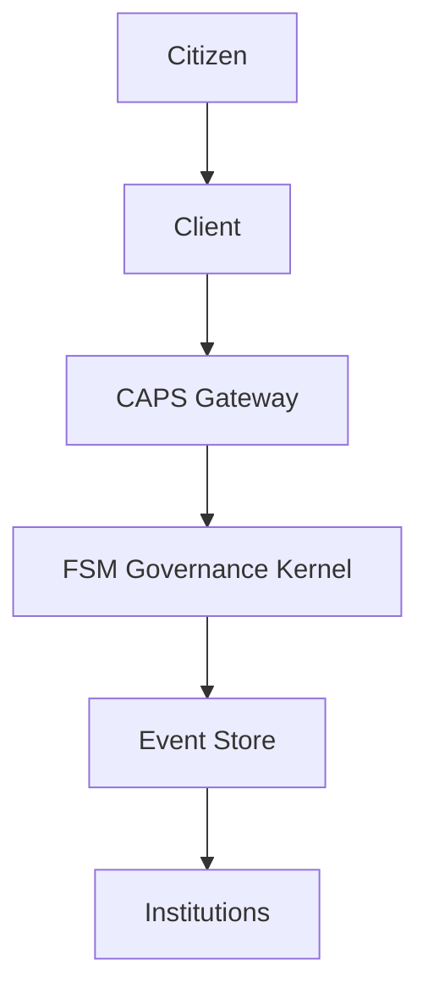

# CUR-FOUNDATION-006
### Constitutional API & Protocol Specification (CAPS)

- **Document ID:** CUR-FOUNDATION-006
- **Version:** 1.2.0-Official-Evergreen
- **Status:** Draft-Official-Evergreen
- **Authority Level:** Foundation Document
- **Depends On:** CUR-FOUNDATION-001, CUR-FOUNDATION-002, CUR-FOUNDATION-003, CUR-FOUNDATION-004, CUR-FOUNDATION-005
- **Applies To:** All Commonwealth Governance Systems

## 1. Purpose

The Constitutional API & Protocol Specification (CAPS) defines the official communication standard used by all Commonwealth governance systems.

CAPS provides:

- Standardized message formats
- Event transmission protocols
- Entity interaction rules
- Constitutional validation procedures
- Simulator integration standards
- Audit and transparency requirements

All governance interactions shall occur through CAPS-compliant messages.

## 2. Design Principles

CAPS shall be:

Transparent
Auditable
Versioned
Machine-readable
Human-readable
Platform-independent
Cryptographically verifiable

## 3. Protocol Architecture



## 4. Message Envelope

All constitutional messages shall use the following structure.

```json
{
  "protocolVersion": "1.0",
  "messageId": "msg-000001",
  "timestamp": "2026-05-20T12:00:00Z",
  "sender": "citizen-3941",
  "messageType": "proposal_submit",
  "payload": {},
  "signature": "optional"
}
```

## 5. Message Categories

### Governance Messages

Examples:

- `proposal_submit`
- `proposal_update`
- `proposal_withdraw`
- `vote_cast`
- `vote_recount_request`
- `Judicial Messages`

Examples:

- `audit_request`
- `appeal_submit`
- `evidence_submit`
- `review_request`

### Economic Messages

Examples:

- `resource_transfer`
- `commons_contribution`
- `dividend_distribution`
- `infrastructure_request`

## Administrative Messages

Examples:

- `citizen_register`
- `organization_register`
- `sector_create`
- `institution_create`

### FSM Messages

Examples:

- `state_transition`
- `fault_detected`
- `protected_mode_entered`
- `protected_mode_exited`
- `capture_risk_alert`

## 6. Standard Response Format

All CAPS responses shall follow:

```json
{
  "type": "response",
  "payload": {
    "status": "success",
    "message": "Operation completed."
  }
}
```

## 7. Standard Error Format

```json
{
  "type": "error",
  "payload": {
    "code": "INVALID_PROPOSAL",
    "message": "Proposal violates constitutional requirements.",
    "field": "title"
  }
}
```

## 8. Error Codes

### Validation Errors

- `INVALID_REQUEST`
- `INVALID_PAYLOAD`
- `INVALID_SIGNATURE`
- `INVALID_ENTITY`

### Governance Errors

- `INVALID_PROPOSAL`
- `PROPOSAL_CLOSED`
- `VOTE_CLOSED`
- `DUPLICATE_VOTE`

### FSM Errors

- `FSM_REJECTED`
- `FORBIDDEN_STATE`
- `PROTECTED_MODE_ACTIVE`
- `STATE_TRANSITION_DENIED`

### Rate Limiting

- `RATE_LIMITED`
- `SPAM_DETECTED`
- `PARTICIPATION_THRESHOLD_EXCEEDED`

## 9. Proposal Submission Protocol

Request:

```json
{
  "messageType": "proposal_submit",
  "payload": {
    "title": "Expand Sector Avia Mining Operations",
    "description": "Proposal text",
    "authorId": "citizen-3941"
  }
}
```

Response:

```json
{
  "type": "response",
  "payload": {
    "proposalId": "PROP-7842",
    "status": "accepted"
  }
}
```

## 10. Voting Protocol

Request:

```json
{
  "messageType": "vote_cast",
  "payload": {
    "proposalId": "PROP-7842",
    "voterId": "citizen-3941",
    "vote": "for",
    "reason": "Supports increased production."
  }
}
```

Allowed vote values:

- for
- against
- abstain

Response:

```json
{
  "type": "response",
  "payload": {
    "voteId": "VOTE-9911",
    "status": "recorded"
  }
}
```

## 11. Audit Protocol

Request:

```json
{
  "messageType": "audit_request",
  "payload": {
    "target": "organization-22",
    "reason": "Capture Risk Threshold Exceeded"
  }
}
```

Response:

```json
{
  "type": "response",
  "payload": {
    "auditId": "AUD-1001",
    "status": "initiated"
  }
}
```

## 12. Appeal Protocol

Request:

```json
{
  "messageType": "appeal_submit",
  "payload": {
    "targetDecision": "SANCTION-44",
    "reason": "New evidence available."
  }
}
```

Response:

```json
{
  "type": "response",
  "payload": {
    "appealId": "APL-22",
    "status": "under_review"
  }
}
```

## 13. FSM Protocol Messages

State Transition

```json
{
  "type": "state_transition",
  "payload": {
    "from": "NormalOperation",
    "to": "Deliberation",
    "trigger": "proposal_submitted"
  }
}
```

Protected Mode

```json
{
  "type": "protected_mode_entered",
  "payload": {
    "reason": "Authority Concentration",
    "severity": "Class IV"
  }
}
```

## 14. Authentication

CAPS implementations shall support:

- Citizen authentication
- Institutional authentication
- AI entity authentication
- Cryptographic signatures

All governance actions must be attributable to a recognized entity.

## 15. Authorization

Entities may only perform actions permitted by:

- Rights for All Life
- Constitutional Authority

### FSM Rules

Institutional Responsibilities

Unauthorized requests shall be rejected.

## 16. Event Generation

Every accepted CAPS request shall generate one or more constitutional events as defined in `CUR-FOUNDATION-005`.

Example:

```text
proposal_submit
    ↓
proposal_submitted event
    ↓
FSM review
    ↓
state_transition event
```

## 17. Audit Logging

All CAPS interactions shall create immutable audit records.

Recorded fields:

- Timestamp
- Sender
- Target
- Action
- Result
- FSM State
- Validation Outcome

## 18. Versioning

CAPS shall use semantic versioning.

Example:

- 1.0.1
- 1.1.0
- 2.0.0

Breaking constitutional changes require major version increments.

## 19. Simulator Integration Requirements

The Aevoria Simulator shall communicate exclusively through CAPS-compliant messages.

Direct state mutation is prohibited.

Simulator interactions must follow:

```
Entity
    ↓
CAPS Message
    ↓
FSM Validation
    ↓
Event Generation
    ↓
State Transition
```

## 20. Constitutional Principle

No governance action shall occur outside the Constitutional API & Protocol Specification.

All actions must be:

- Observable
- Auditable
- Traceable
- Constitutionally valid

## 21. Guiding Principle

CAPS serves as the constitutional nervous system of the Commonwealth.

It ensures that every proposal, vote, audit, appeal, resource transfer, and institutional action flows through a transparent and accountable governance protocol.