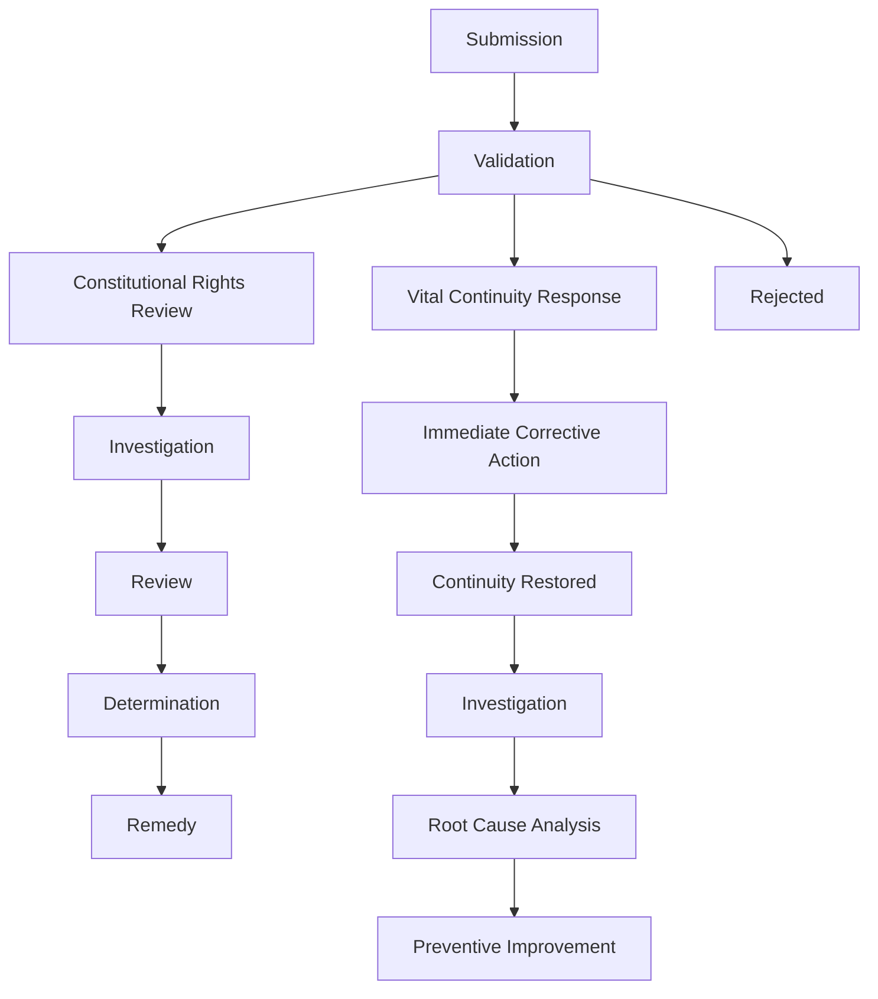

# CUR-FOUNDATION-012
### Constitutional Rights Enforcement Framework (CREF)

- **Document ID:** CUR-FOUNDATION-012
- **Version:** 1.2.0-Official-Evergreen
- **Status:** Draft-Official-Evergreen
- **Authority Level:** Foundation Document
- **Depends On:** CUR-FOUNDATION-001 through CUR-FOUNDATION-011
- **Applies To:** All Commonwealth Institutions, Citizens, Organizations, and Recognized Intelligences

## 1. Purpose

The Constitutional Rights Enforcement Framework (CREF) establishes how constitutional rights are protected, investigated, enforced, restored, and defended.

Rights without enforcement are declarations.

Rights with enforcement become guarantees.

## 2. Foundational Principle

Every recognized entity possesses constitutional rights.
Every constitutional right shall include a means of protection, enforcement, and restoration.

Every constitutional right must possess:

- Enforcement mechanisms
- Appeal mechanisms
- Restoration mechanisms
- Oversight mechanisms

No right shall exist without a remedy.

## 3. Rights Categories

CREF applies to:

Fundamental Rights

Rights for All Life

Civic Rights

Voting, participation, proposal creation

Economic Rights

Property, enterprise, contribution credit compensation

Resource Commons Rights

Access to guaranteed necessities

Interior Sovereignty Rights

Mental autonomy and self-determination

Due Process Rights

Investigation and appeal protections

## 4. Resource Commons Guarantee

The Aevoric Commonwealth shall guarantee access to all basic necessities required for dignified existence.

Guaranteed necessities include:

### Life Support Guarantees

- Clean Air
- Water
- Food
- Shelter
- Clothing
- Personal Hygiene
- Healthcare

### Knowledge and Education Guarantees

- Education
- Higher Education
- Advanced Training and Certification

### Infrastructure Guarantees

- Electrical Power
- Communication Access
- Transportation
- Disabilities-Compliant Infrastructure

### Information Guarantees

- Privacy
- Earth Weather Services
- Space Weather Services

### Economic Participation Guarantees

- Access to Meaningful Economic Participation
- Research Facilities
- Common Use Laboratories
- Safe Regulated Trade Networks
- Retirement Dignity and Security

These are constitutional guarantees.

They are not conditional upon wealth.

They are not conditional upon employment.

They are not conditional upon political alignment.

## 5. Rights Violation Definition

A rights violation occurs when:

- A protected right is denied
- A protected right is restricted unlawfully
- A protected right is interfered with
- A protected right is removed without due process

## 6. Violation Severity Classes

### Class I

Minor procedural violations.

Examples:

- Administrative delays
- Reporting failures
- Record keeping deficiencies

### Class II

Significant rights interference.

Examples:

- Improper denial of participation
- Improper denial of information

### Class III

Major constitutional violations.

Examples:

- Suppression of voting rights
- Improper sanctions
- Systematic discrimination

### Class IV

Critical constitutional violations.

Examples:

- Resource deprivation
- Refusing access to guaranteed necessities
- Monetizing guaranteed necessities
- Institutional capture
- Mass rights violations

## 7. Constitutional Complaint and Review Process

Any recognized entity may submit:

* Complaint
* Petition
* Appeal
* Constitutional Review Request
* Vital Continuity Service Failure Report through CAPS.

Complaints, petitions, appeals, and review requests exist to address disputes, investigate violations, and evaluate constitutional compliance.

Vital Continuity Service Failure Reports exist to identify interruptions or degradation of constitutionally guaranteed services.

Reports involving Vital Continuity Services shall prioritize immediate continuity restoration before investigation, fault determination, or administrative review.

The purpose of this process is to protect rights, preserve continuity, and maintain constitutional integrity.

## 8. Complaint Lifecycle

## 9. Investigation Authority

Authorized investigators may:

- Collect evidence
- Interview participants
- Review records
- Request audits

Investigations must respect constitutional rights.

## 10. Rights Protection Actions

Protective actions may be initiated when:

* Immediate harm exists
* Vital Continuity Services are disrupted or threatened
* Constitutional rights face imminent violation
* Constitutional integrity is at risk

Protective actions exist to preserve life, continuity, safety, and constitutional rights.

Protective actions shall be limited to the minimum scope necessary to address the identified condition.

Protective actions shall not suspend constitutional rights, expand constitutional authority, create emergency powers, or bypass due process protections.

All protective actions shall be subject to review, audit, and constitutional oversight.

Crises shall not alter constitutional authority.

Constitutional protections remain in force at all times.

## 11. Resource Commons Enforcement

The denial of guaranteed necessities shall trigger automatic review.

Examples:

- Food Access Failure
- Shelter Access Failure
- Medical Access Failure
- Water Access Failure

These examples and all other incidents not listed shall generate constitutional events.

## 12. Remedies

Possible remedies include:

- Restoration
- Correction
- Compensation
- Reinstatement
- Public Disclosure
- Institutional Reform

The objective of the Commonwealth is to restore rights, continuity, and constitutional integrity before assigning fault or imposing sanctions whenever reasonably possible.

## 13. Restitution Principle

Entities harmed by constitutional violations may receive restitution.

Restitution may include:

- Resource Compensation
- Service Restoration
- Reputational Correction
- Economic Compensation

## 14. Due Process Requirements

No enforcement action may occur without:

* Notice
* Explanation
* Opportunity to Respond
* Appeal Process

Immediate protective actions may be taken when necessary to preserve life, continuity, safety, or constitutional integrity.

Such actions shall be limited to the minimum scope necessary to address the identified condition.

Protective actions shall not suspend constitutional rights, bypass due process protections, expand constitutional authority, or create extraordinary powers outside the constitutional framework.

The Commonwealth shall not recognize constitutional suspension, indefinite extraordinary authority, or temporary exceptions to Rights for All Life, Interior Sovereignty, constitutional voting rights, or due process guarantees.

When severe system failures, crises, disasters, conflicts, or other destabilizing conditions occur, governance systems shall continue operating through established constitutional processes, Constitutional Continuity Actions, Safe-State Procedures, and Protected Mode mechanisms.

Crises shall not alter constitutional authority.

All protective actions shall remain subject to transparency requirements, audit review, constitutional oversight, and post-action evaluation.

Constitutional protections remain in force at all times.

## 15. Appeals

All major decisions shall be appealable.

Appeals may be reviewed by:

- Citizen Review
- Constitutional Court
- Independent Panels

## 16. Institutional Accountability

Institutions are subject to CREF.

No institution is exempt.

No officeholder is above review.

## 17. AI and Silicon Entity Rights

Recognized silicon entities receive:

- Investigation protections
- Due process protections
- Appeal rights according to Rights for All Life.

## 18. Audit Integration

All rights enforcement actions shall be auditable through CTAF.

All decisions shall generate:

- Events
- Records
- Audit Trails

## 19. FSM Integration

Repeated rights violations may trigger:

- AuditInvestigation
- CaptureRiskReview
- ProtectedMode FSM states.

## 20. Resource Commons Monitoring

The Commonwealth shall continuously monitor:

- Food Availability
- Housing Capacity
- Healthcare Capacity
- Education Capacity
- Communication Availability
- Privacy Concerns or Violations
- Electrical Power Availability
- Earth Based Weather Forecasts, Current Observations, and Hazardous Weather Alerts Availability
- Space Based Weather Forecasts, Current Observations, and Hazardous Space Weather Alerts Availability
- Clean Air Availability
- Clothing Availability
- Water Availability
- Personal Hygiene Availability
- Higher Education Capacity
- Advanced Training and Certification Capacity
- Stable, Rewarding Career Capacity
- Safe, Regulated Trade Networks Availability
- Research and Development Resources and Common Use Labs Capacity
- Training and Certification for Advanced Research and Development Capacity
- Public and Basic Private Transportation Capacity
- Public Infrastructure, Disabilities Compliant Availability

Deficiencies require corrective action.

## 21. Simulator Requirements

The Aevoria Simulator shall model:

- Rights violations
- Appeals
- Resource shortages
- Institutional misconduct
- Last safe version safety rollback protections
- Commons failures to evaluate constitutional resilience.

## 22. Constitutional Principle

No citizen shall lose access to the necessities of life because of poverty.

No child shall be denied opportunity because of circumstance.

No recognized entity shall be denied due process.

Rights exist to be exercised, protected, and restored.

## 23. Guiding Principle

The Constitutional Rights Enforcement Framework serves as the protective layer of the Commonwealth.

Its purpose is to ensure that constitutional promises become lived reality through enforceable guarantees, transparent remedies, and equal protection under the law.